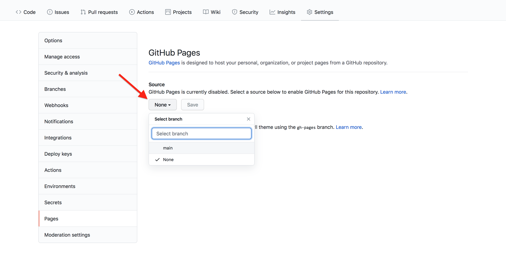
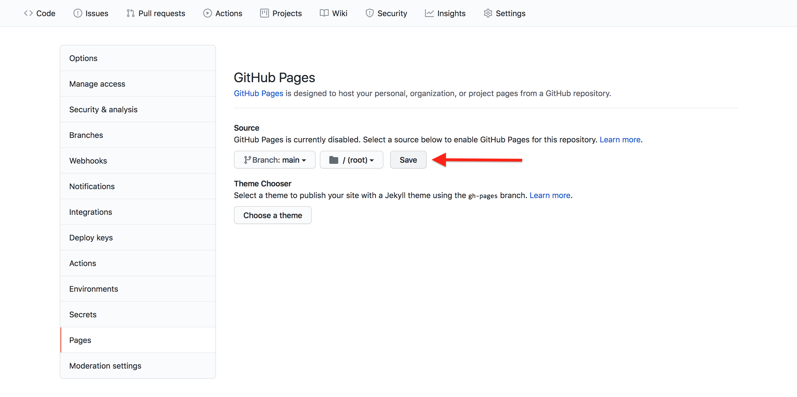
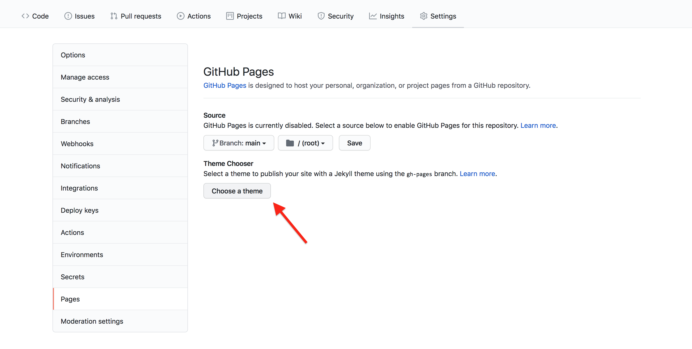
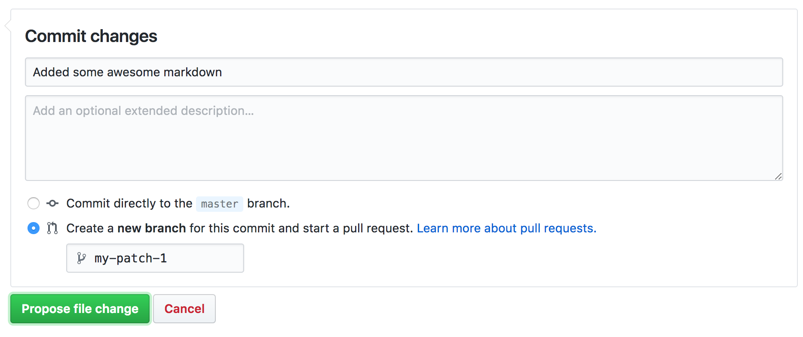

## GitHub Pages

GitHub Pages is a simple service to publish a website directly on GitHub from a Git repository.
You add some files and folders to a repository and GitHub Pages turns it into a website.
You can use HTML directly if you like, but they also provide Jekyll,
which renders Markdown into HTML and makes it really easy to setup a blog or a template-based website.

### Why GitHub Pages is awesome!

GitHub Pages allows you to version control your website. This is useful for a lot of different reasons. It allows you to
keep a record of what changes you have made. It allows people to reference your website at a particular point in time
and (if you make your source open) to see what it was like at that particular point in time. This is very useful for
academic citations. Most people have had the experience of following up a reference to a website and either getting a
404 error or seeing something completely different. Although using versions on your site doesn't guarantee this won't
happen, it does make it easier to manage old versions of your site.

GitHub Pages also mean that you can collaborate on a website with a lot of people without everyone having to
communicate endlessly back and forwards about what changes need to be made, or have been made already. You can create
'issues' (things that need discussing or fixing), list things to do in the future, and allow other people visiting your
website to quickly suggest, and help implement changes through pull requests.

### Enable GitHub Pages

GitHub Pages is turned off by default for all new repositories, and can be turned on in the settings menu for any repository.

Let's set up a new site by enabling GitHub Pages for our project.

Go to the Pages section of your repository's Settings:

#### Source branch (required)

Pages needs to know the branch in your repository from which you want to serve your site. This can be any branch, including `main`.

Select then save the source branch:

#### Theme (optional)

GitHub Pages provides different themes to visually style and organize your site's content. Choosing a theme is optional, and themes can be interchanged quickly.

See the [GitHub Pages documentation](https://docs.github.com/en/pages/getting-started-with-github-pages/adding-a-theme-to-your-github-pages-site-with-the-theme-chooser) for further information on using themes.

### View your site

If we now visit `https://some-librarian.github.io/hello-world/`,
we should see the contents of the index.md file that created earlier.
Usually it's available instantly, but it can take a few seconds and in the worst case a few minutes if GitHub are very busy.

> ## Challenge: Contributing to a page owned by someone else (slightly easier way)
>
> To practice using Git, GitHub pages and Markdown we can contribute to a GitHub pages site.
> Pair up in groups of two (or more if needed) and do the exercises below together.
>
> 1. Go to https://github.com/some-librarian/hello-world, where "some-librarian" is the username of your exercise partner.
> 2. Click on "Fork" in the upper right part of the screen to create a copy of the repository on your account. Once you have a fork > of your partner's repository, you can edit the files in your own fork directly.
> 3. Click the "index.md" file, then click the edit pencil icon:
>
>    
>
> 4. Now is good chance to try some Markdown syntax.
>    Try some of the examples at [Mastering Markdown](https://guides.github.com/features/mastering-markdown/).
>    You can preview how it will look before you commit changes.
> 5. Once you are ready to commit, enter a short commit message,
>    select "Create a new branch for this commit and start a pull request"
>    and press "Propose file change" to avoid commiting directly to the main branch.
>
>    
>
> 8. You can now go to the repository on your account and click "New Pull Request" button,
>    where you can select base branches repositories, review the changes and add an additional
>    explanation before sending the pull request (this is especially useful
>    if you make a single pull request for multiple commits).
> 9. Your partner should now see a pull request under the "Pull requests" tab
>    and can accept ("Merge pull request") the changes there. Try this.
>
> This whole process of making a fork and a pull request might seem a bit cumbersome.
> Try to think of why it was needed? And why it's called "pull request"?
>
> > ## Solution
> > We made a fork and a pull request because we did not have permission to edit
> > (or commit) the repository directly. A fork is a copy of the repository that
> > we *can* edit. By making a pull request we ask the owner of the repository if
> > they would like to accept (pull in) the changes from our fork (our copy) into
> > their version. The owner can then review the changes and choose to accept or
> > reject them.
> >
> > You can open pull requests on any repository you find on GitHub. If you are a
> > group of people who plan to collaborate closely, on the other hand,
> > it's more practical to grant everyone access to commit directly instead.
> >
> {: .solution}
{: .challenge}

> ## Optional challenge: Contributing to a page owned by someone else (slightly more complicated way)
>
> Instead of making edits on the GitHub website you can 'clone' the fork to your local machine
> and work there.
>
> Try following the steps in [GitHub's quickstart guide for contributing to projects](https://docs.github.com/en/get-started/quickstart/contributing-to-projects)
>
> (If you followed step 1 and 2 in the previous challenge,
> you already have a fork and you can skip the creation of a new fork. 
> Start instead at the section titled "Cloning a fork." 
> You can submit multiple pull requests using the same fork.)
>
{: .challenge}

> ## Optional challenge: Adding an HTML page
>
> GitHub Pages is not limited to Markdown. If you know some HTML, try adding an HTML page
> to your repository. You could do this on the command line or directly on GitHub. The
> steps below are for working directly on GitHub:
>
> 1. Make sure you are working on the "gh-pages" branch. Select it from the menu if not:
>
>    
>
> 2. To add a new file directly on GitHub, press the "Create new file" button.
>
>    
>
> 3. Name it 'test.html', add some HTML and click "Commit new file".
> 4. Try opening `https://some-librarian.github.io/hello-world/test`
>    (replace "some-librarian" with your username).
>    Notice that the HTML extension is not included.
>
{: .challenge}
